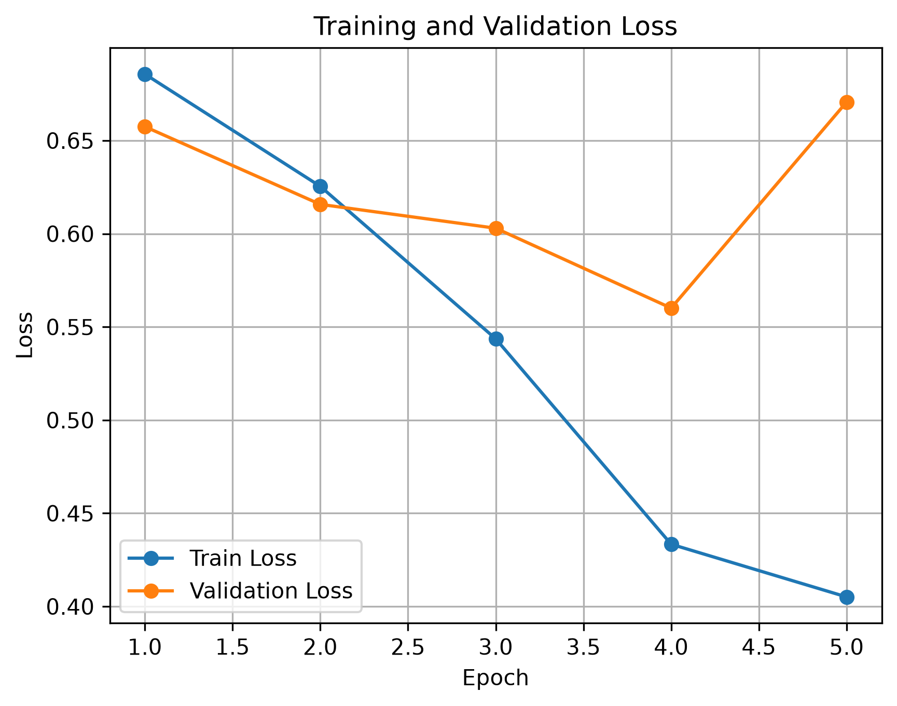
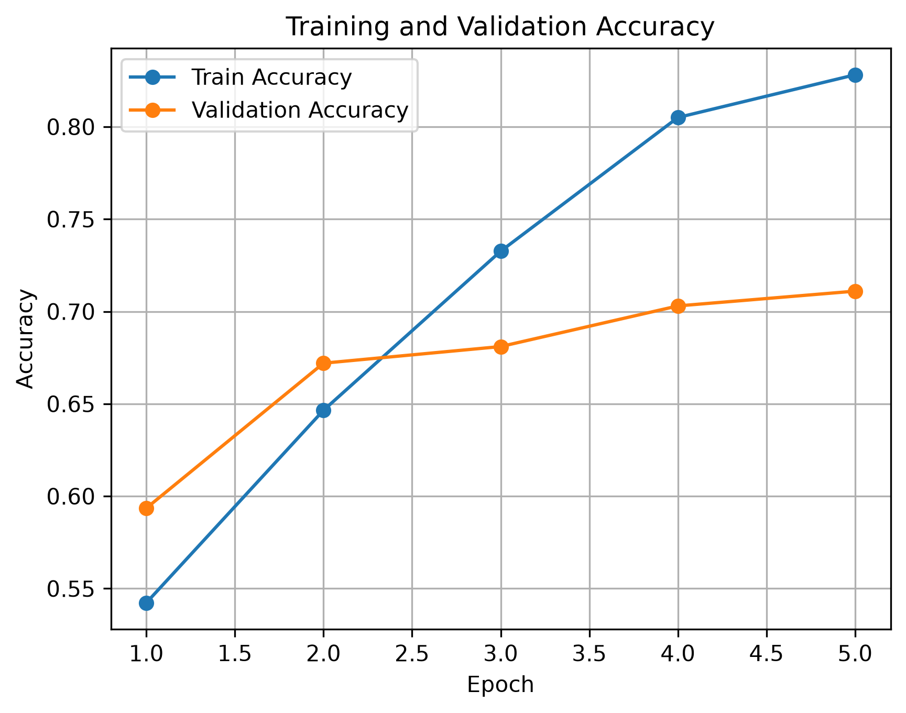
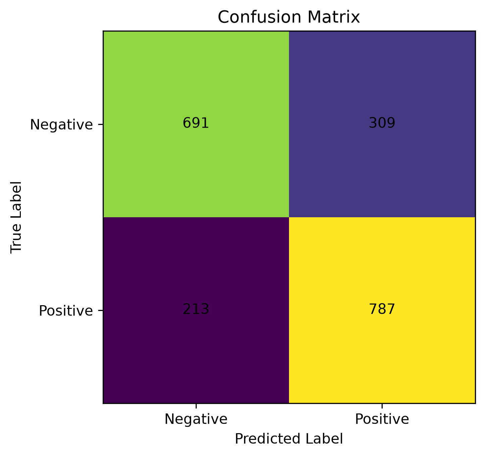

# IMDB 영화 리뷰 감정 분류

PyTorch를 공부하면서 기본적인 딥러닝 학습 과정을 직접 구현해보기 위해 만든 프로젝트입니다.

IMDB 영화 리뷰 데이터를 사용해서 리뷰가 긍정적인지 부정적인지를 분류하는 LSTM 모델을 만들었습니다.

## 데이터

Hugging Face의 IMDB 데이터셋을 사용했습니다.

- Train: 8,000
- Validation: 2,000
- Test: 2,000
- Negative: 0
- Positive: 1

## 모델

모델 구조는 간단하게 만들었습니다.

Embedding → LSTM → Dropout → Linear

주요 설정은 다음과 같습니다.

- Embedding dimension: 128
- Hidden dimension: 128
- Dropout: 0.5
- Loss: CrossEntropyLoss
- Optimizer: Adam
- Learning rate: 0.001

## 학습

처음에는 기본 LSTM 모델로 학습했습니다.

학습이 진행될수록 Train Accuracy는 계속 올라갔지만
Validation 성능은 그만큼 좋아지지 않는 것을 확인했습니다.

과적합을 줄여보기 위해 Dropout을 추가했고
기본 LSTM과 Validation Accuracy를 비교했습니다.

또 Validation Loss가 더 이상 좋아지지 않을 경우 학습을 멈추고
가장 좋은 모델을 저장하도록 Early Stopping도 구현했습니다.

## 결과

최종 모델을 Test 데이터 2,000개로 평가했습니다.

- Test Accuracy: 73.9%
- Test Loss: 0.6001

### Confusion Matrix

| 실제 / 예측 | Negative | Positive |
| Negative   | 691     | 309       |
| Positive   | 213     | 787       |

Negative 리뷰는 1,000개 중 691개,
Positive 리뷰는 1,000개 중 787개를 맞췄습니다.

Positive 리뷰를 조금 더 잘 분류하는 결과가 나왔습니다.

## 오분류 확인

모델이 틀린 리뷰도 직접 확인해봤습니다.

특히 긍정적인 표현과 부정적인 표현이 같이 들어있는 리뷰에서
잘못 분류하는 경우가 있었습니다.

또 영화 내용 자체는 부정적인 내용이지만
작성자는 영화를 좋게 평가한 리뷰를 Negative로 예측하는 경우도 있었습니다.

간단한 공백 기반 토큰화와 LSTM만 사용했기 때문에
긴 리뷰의 전체 문맥을 정확하게 파악하는 데 한계가 있다고 생각했습니다.

## 결과 그래프

학습 결과를 확인하기 위해 다음 그래프를 만들었습니다.

- Train / Validation Loss
학습이 진행될수록 Train Loss는 계속 감소했지만,
Validation Loss는 일정 시점 이후 다시 증가하는 모습을 확인했습니다.

- Train / Validation Accuracy
Train Accuracy와 Validation Accuracy의 변화를 비교했습니다.

- 기본 LSTM과 Dropout 모델 비교
기본 LSTM과 Dropout을 적용한 모델의 Validation Accuracy를 비교했습니다.

- Confusion Matrix
Test 데이터에서 실제값과 모델의 예측값을 비교했습니다.

## 프로젝트를 하면서 공부한 내용

이번 프로젝트를 만들면서 PyTorch의 기본적인 학습 과정을 직접 구현해봤습니다.

`Dataset`과 `DataLoader`로 데이터를 batch 단위로 가져오는 방법,
Embedding과 LSTM에서 tensor의 shape이 어떻게 변하는지,
loss를 계산하고 `backward()`와 `optimizer.step()`으로 모델이 학습되는 과정을 공부했습니다.

또 Train / Validation / Test 데이터를 나누는 이유와
과적합이 발생했을 때 Dropout과 Early Stopping을 사용하는 방법도 확인했습니다.